<p align="center">
  
</p>

<h1 align="center">Lekha</h1>

<p align="center">
  <em>A ledger for money that moves — built to be read, not just trusted.</em>
</p>

<p align="center">
  
  
  
  
  
  
  
</p>

<p align="center">
  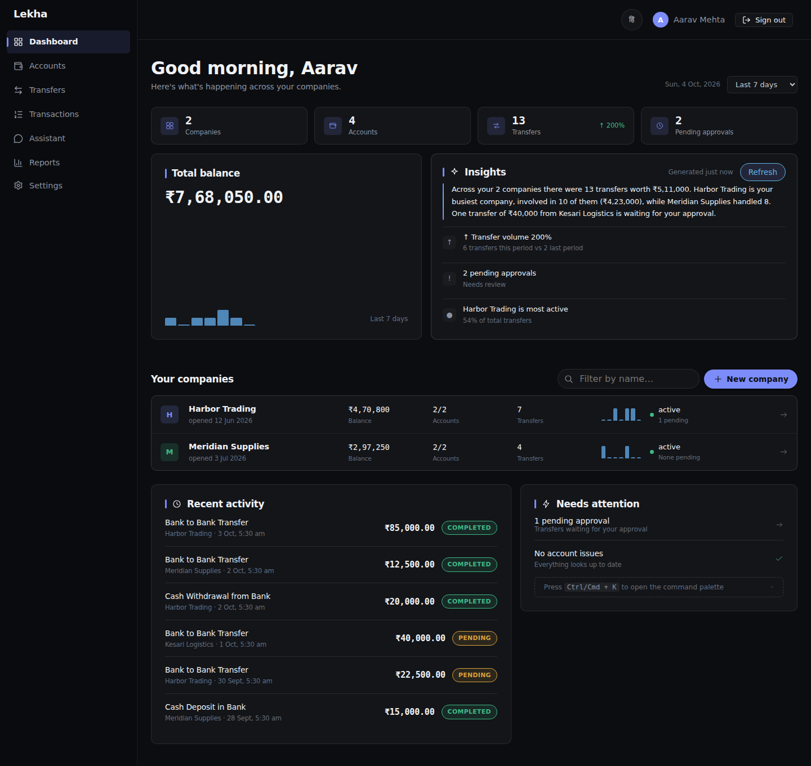
</p>

> **Lekha** (लेखा) is Hindi for an *account* or a *written record*. It is a web app for people who run
> more than one company and need one clear place to see their **companies, bank and cash accounts,
> transfers, reports and AI-assisted insights**.
>
> _All screenshots in this README use made-up sample data (fictional companies and amounts), not real accounts._

---

## Contents

- [What is Lekha?](#what-is-lekha)
- [A quick tour](#a-quick-tour)
- [Features](#features)
- [How transfers and approvals work](#how-transfers-and-approvals-work)
- [How the AI is used](#how-the-ai-is-used)
- [Architecture](#architecture)
- [Tech stack](#tech-stack)
- [Data model](#data-model)
- [API overview](#api-overview)
- [Getting started](#getting-started)
- [Configuration reference](#configuration-reference)
- [Project structure](#project-structure)
- [Development notes](#development-notes)

---

## What is Lekha?

If you run several businesses, money constantly moves between them — and between their bank and cash
accounts. Lekha keeps that organised:

1. **Add your companies** and invite teammates. Admins decide who can do what.
2. **Add bank and cash accounts** to each company, then **create transfers** between any two accounts.
   Lekha works out the transfer type for you (bank → bank, cash deposit, cash withdrawal…).
3. **Understand the activity** with reports, charts and plain-language summaries. Every figure is
   calculated from your own records first; the AI only *describes* numbers it is given.

When money crosses from one company to another, the **receiving company has to approve it** before any
balance changes. Nothing moves halfway: a transfer either completes or it doesn't.

<p align="center">
  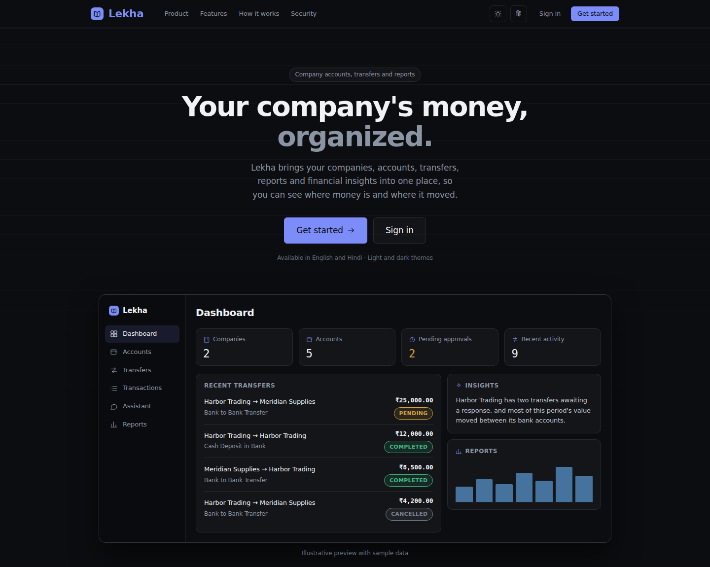
</p>

## A quick tour

### Sign in and sign up

A calm two-pane page. The left pane rotates through short "Did you know?" facts about Lekha and about
money and bookkeeping (with a progress bar that pauses on hover and stands still if you prefer reduced
motion). Light/dark and English/Hindi toggles sit in the corner.

<p align="center">
  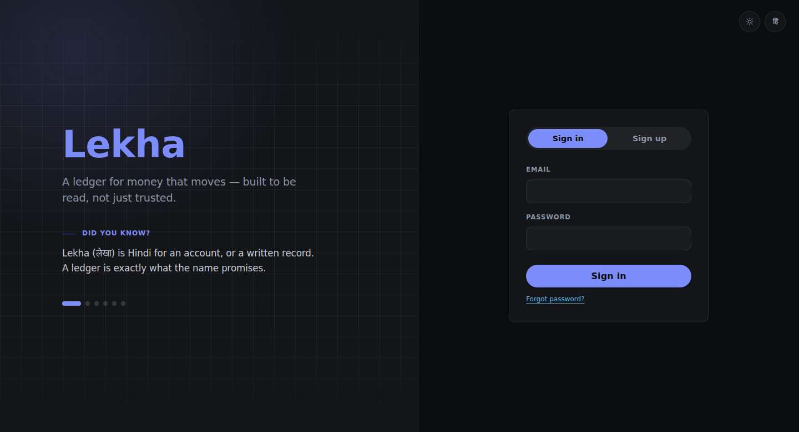
</p>

### Dashboard

Totals across every company you belong to, your combined balance with a 7-day activity bar, an
AI-written **Insights** card (with computed findings next to it), every company at a glance, recent
activity, and a **Needs attention** list for transfers waiting for your approval.

<p align="center">
  
</p>

### A company

One page per company: balance, accounts, pending approvals, members (promote or demote admins), its own
AI insights, its accounts, and a transfer form with a transfer ledger and natural-language search such as
_"completed transfers over 10000"_.

<p align="center">
  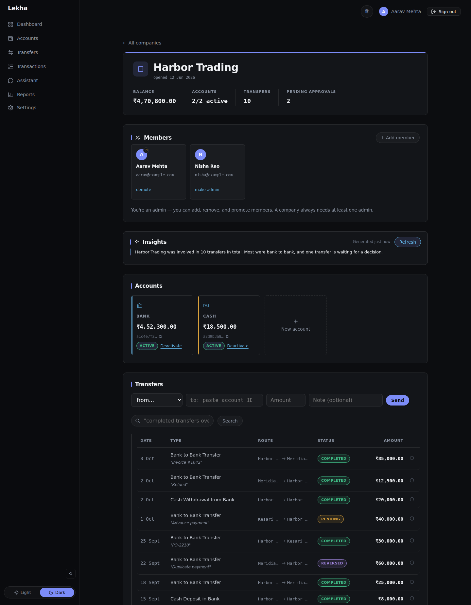
</p>

### Transfers, transactions and approvals

**Transfers** lists the transfers you started; **Transactions** is the full read-only ledger of everything
you can see, sent or received. Click any row for the details. A transfer that needs *your* approval says so
and offers **Approve** and **Reject**.

<p align="center">
  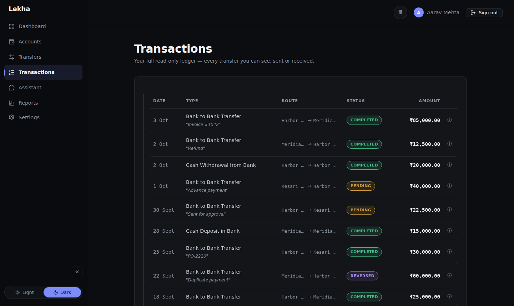
</p>

<p align="center">
  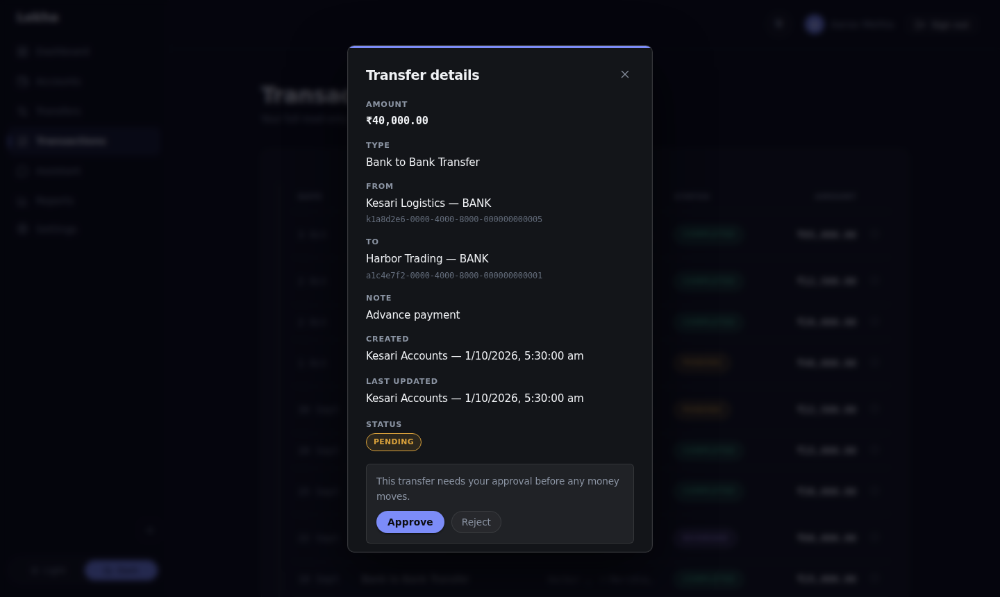
</p>

### Reports — and charts that explain themselves

Six charts: volume and value over time, status breakdown, top companies, incoming vs outgoing, transfer
types, and top accounts. Pick a date range and a company (or all of them). The **AI summary** at the top
describes the whole period.

<p align="center">
  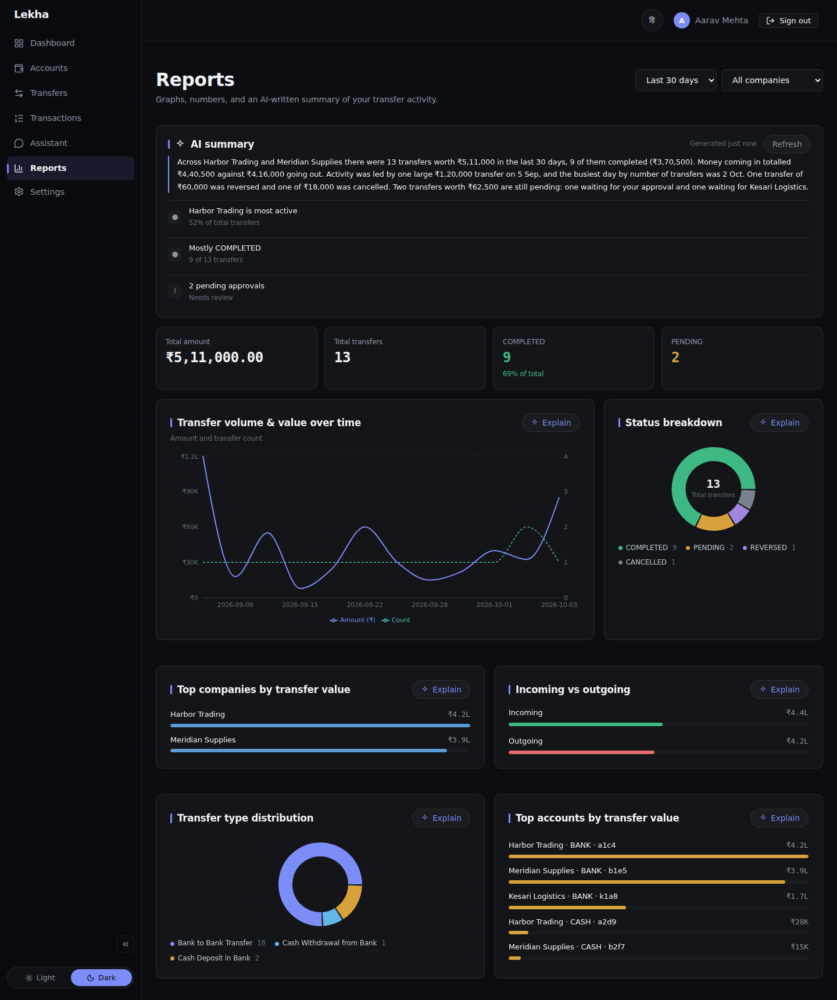
</p>

Every chart has an **Explain** button. Click it and the AI summary gains a tab that explains *that chart*:
how to read it, its highest and lowest points, what dominates, and which real transfers shape it.

<p align="center">
  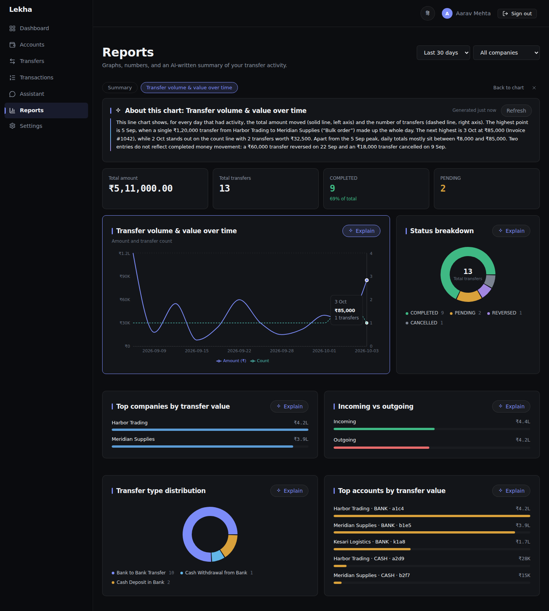
</p>

### Assistant

Ask questions in plain language about your accounts and transfers. It can also **propose** an action — for
example approving a pending transfer — but it never does anything by itself: you confirm every action.

<p align="center">
  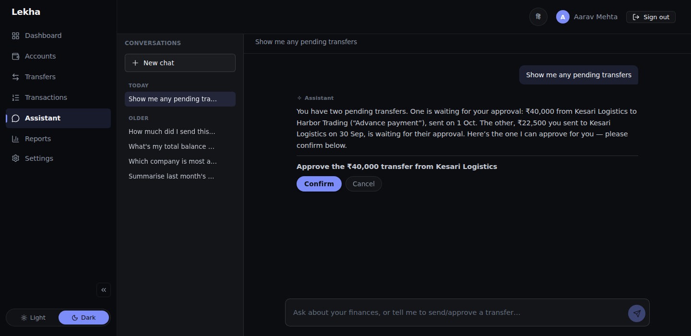
</p>

### Light, dark, and Hindi

Both themes are first-class, and the interface, the insights and the assistant's replies are available in
English and Hindi.

<p align="center">
  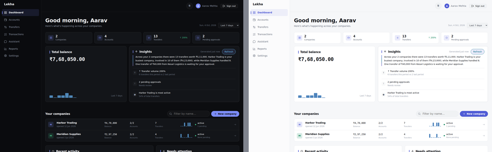
</p>

<p align="center">
  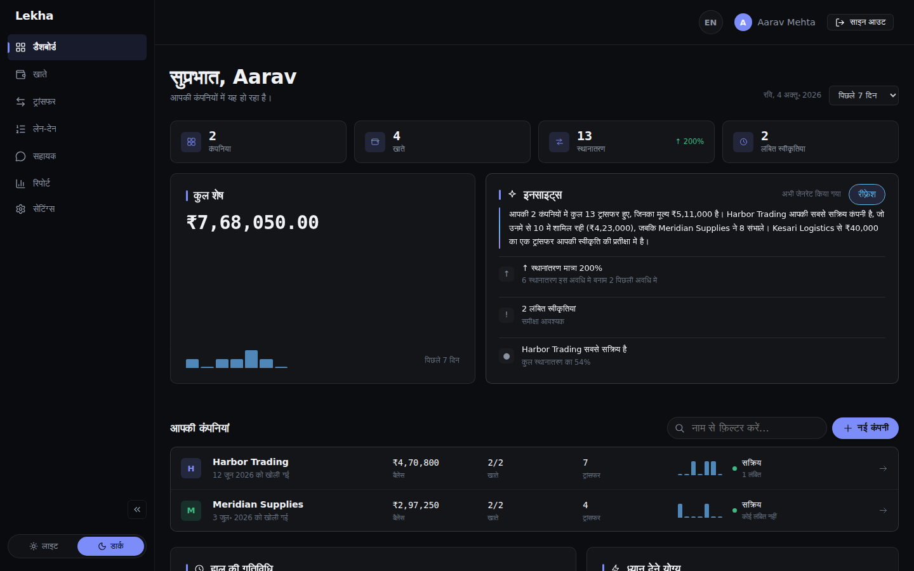
</p>

### Works on phones

The whole signed-in app is responsive down to small phones (checked at widths as small as 320 px). Status
badges and amounts line up in one column in every list.

<p align="center">
  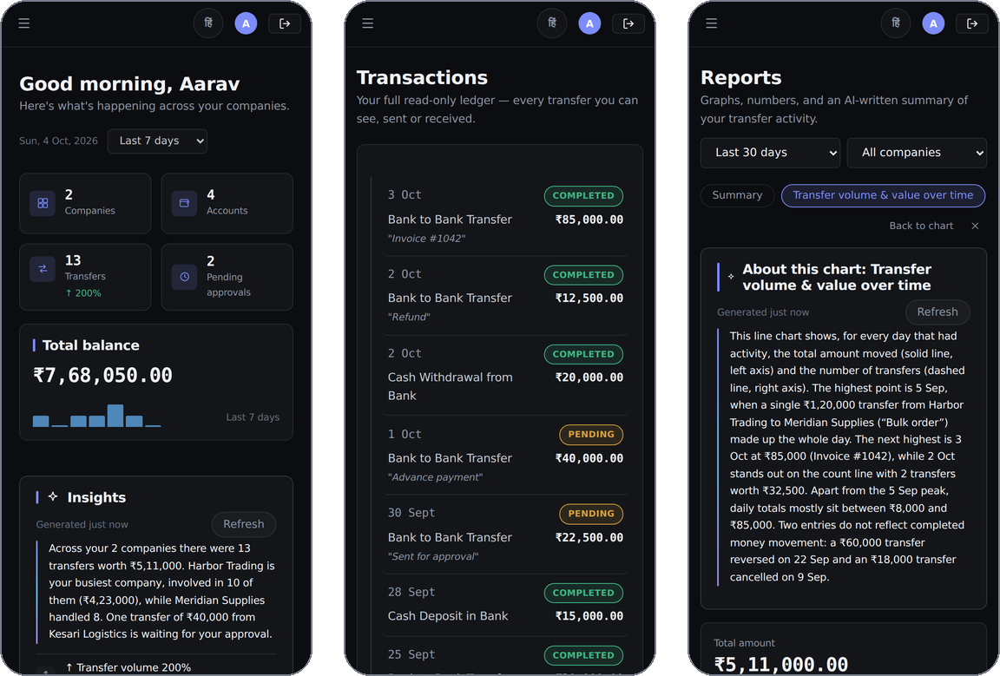
</p>

---

## Features

**Companies and accounts**
- Belong to many companies; one dashboard across all of them.
- Admins can add members by email, promote/demote admins, and rename or delete a company
  (rename and delete re-ask for the admin's password). A company always keeps at least one admin.
- Bank and cash accounts per company, each with its own balance; accounts can be deactivated or deleted.
- Deleting an account or company is a **soft delete**: it disappears from your lists, balances and reports,
  but transfers are kept so the *other* company's history stays complete (the deleted side is marked
  "Deleted"). Deleting is refused while a transfer is still waiting on a decision.

**Transfers**
- Create a transfer between any two active accounts; the transfer type is detected automatically.
- Two-sided **approval workflow** for transfers between companies, including **reversal requests**.
- Natural-language search: type _"pending transfers over 5000"_ and get a filtered list.
- Money movement is transactional with row locks, so a transfer never completes halfway.

**Reports and insights**
- Volume over time, status breakdown, types, incoming vs outgoing, top companies, top accounts.
- Compare against the previous period; filter by company and date range.
- **AI summary** of the period and a per-chart **Explain** that cites the real transfers behind a chart.

**AI assistant**
- Answers questions from your own data; proposes (never executes) approvals, rejections and transfers.
- Saved conversations with a history sidebar.

**Accounts and sessions**
- Sign up / sign in, email verification, forgot/reset password, change password, profile picture.
- Light and dark themes, English and Hindi, a command palette (<kbd>Ctrl</kbd>/<kbd>⌘</kbd> + <kbd>K</kbd>),
  and a responsive layout from phones to wide desktops.

## How transfers and approvals work

The transfer **type** is derived from the two accounts, so you never pick it:

| From → To | Type |
|---|---|
| Bank → Bank | `BANK TO BANK TRANSFER` |
| Cash → Bank | `CASH DEPOSIT IN BANK` |
| Bank → Cash | `CASH WITHDRAWAL FROM BANK` |
| Cash → Cash | `CASH ACCOUNT TRANSFER` |

The **status** depends on who owns the two accounts:

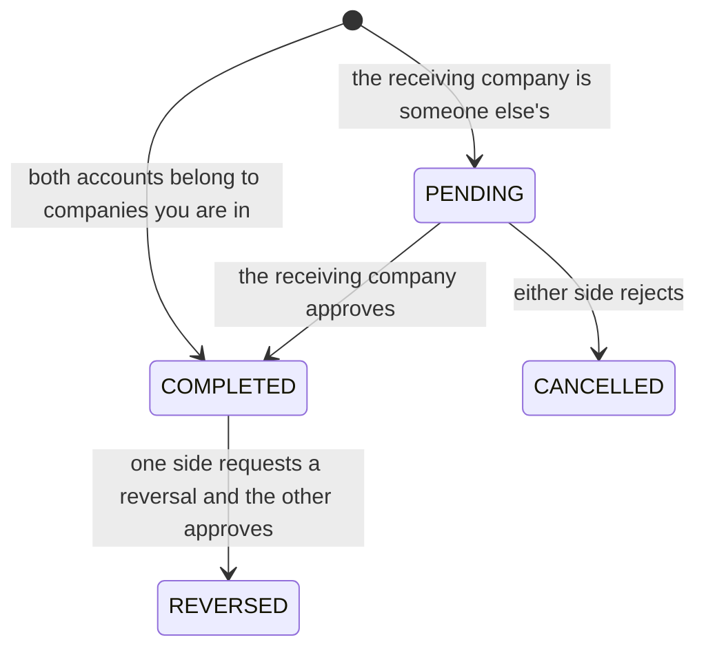
```mermaid
stateDiagram-v2
    [*] --> COMPLETED: both accounts belong to companies you are in
    [*] --> PENDING: the receiving company is someone else's
    PENDING --> COMPLETED: the receiving company approves
    PENDING --> CANCELLED: either side rejects
    COMPLETED --> REVERSED: one side requests a reversal and the other approves
```

- Balances change only when a transfer **completes** (or a reversal is approved). A pending transfer moves no money.
- A reversal request can be **withdrawn** by whoever proposed it, or rejected by the other side (the transfer then stays completed).
- A transfer that involves a deleted account can no longer be reversed.

## How the AI is used

Lekha follows one rule everywhere: **numbers are computed by the backend (SQL and Go) first, and the model
only phrases them.** It is never asked to calculate, and its prompts forbid inventing figures.

| Feature | What is sent to the model | What it does |
|---|---|---|
| Dashboard / company **insights** | The already-computed summary numbers | Writes a short narrative |
| Reports **AI summary** | The computed report for the chosen scope and range | Writes a narrative |
| Reports **Explain** | The report numbers for that chart + up to ~30 real transfers behind it (no ids, no free-text notes) | Explains how to read the chart and what shapes it |
| **Search** box | Only the sentence you typed | Turns it into a filter that is whitelisted before it reaches SQL — the model never sees your data |
| **Assistant** | A summary of your companies, accounts and pending transfers + the conversation | Answers, and may *propose* an action that the server validates |

The assistant's proposals are never executed by the model. You press **Confirm**, and the app calls the same
ordinary endpoints (approve / reject / create transfer) that the buttons elsewhere use:

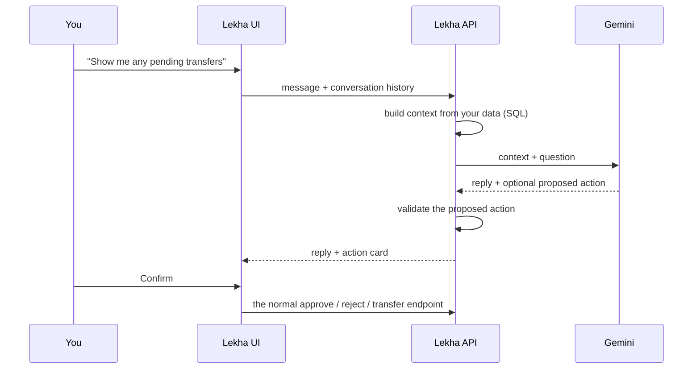
```mermaid
sequenceDiagram
    participant You
    participant UI as Lekha UI
    participant API as Lekha API
    participant AI as Gemini
    You->>UI: "Show me any pending transfers"
    UI->>API: message + conversation history
    API->>API: build context from your data (SQL)
    API->>AI: context + question
    AI-->>API: reply + optional proposed action
    API->>API: validate the proposed action
    API-->>UI: reply + action card
    You->>UI: Confirm
    UI->>API: the normal approve / reject / transfer endpoint
```

All AI calls go through one small module (`backend/utils/llm.go`), so it is easy to audit exactly what leaves
the server. Without a `GEMINI_API_KEY` the app still works — you simply don't get AI-written text.

## Architecture

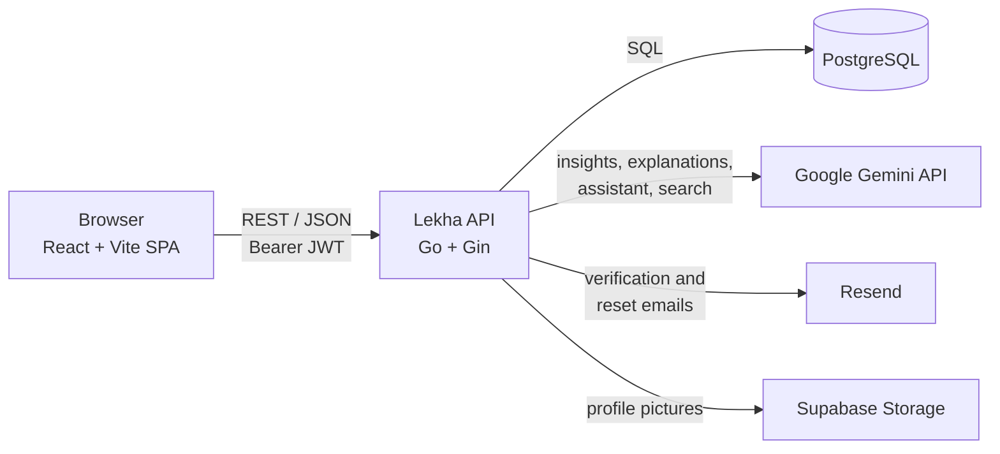
```mermaid
flowchart LR
    Browser["Browser<br/>React + Vite SPA"] -->|"REST / JSON<br/>Bearer JWT"| API["Lekha API<br/>Go + Gin"]
    API -->|SQL| DB[("PostgreSQL")]
    API -->|"insights, explanations,<br/>assistant, search"| LLM["Google Gemini API"]
    API -->|"verification and<br/>reset emails"| Mail["Resend"]
    API -->|profile pictures| Storage["Supabase Storage"]
```

- The **backend** is a stateless Go service using plain `database/sql` (no ORM). Handlers hold the logic;
  `utils/` holds auth, rate limiting, membership checks, the LLM client and i18n message catalogues.
- The **frontend** is a single-page React app. Routing is `react-router`; the signed-in app is code-split
  so the public landing and sign-in pages load quickly.
- Sessions are signed JWTs (24 h) that the app silently refreshes while it is in use.

## Tech stack

| Layer | Technology |
|---|---|
| Backend | Go 1.22, [Gin](https://github.com/gin-gonic/gin) 1.10, `lib/pq`, `golang-jwt/jwt` v5, `bcrypt` (`x/crypto`) |
| Database | PostgreSQL |
| Frontend | React 18, Vite 5, `react-router-dom` 7, Framer Motion, Recharts, `lucide-react` — plain CSS design tokens, no UI framework |
| AI | Google Gemini API (called over plain HTTP, no SDK) |
| Email | [Resend](https://resend.com) (plain HTTP) |
| Files | Supabase Storage for profile pictures (plain HTTP) |

## Data model

A simplified view of the tables the backend uses. Only key columns are shown.

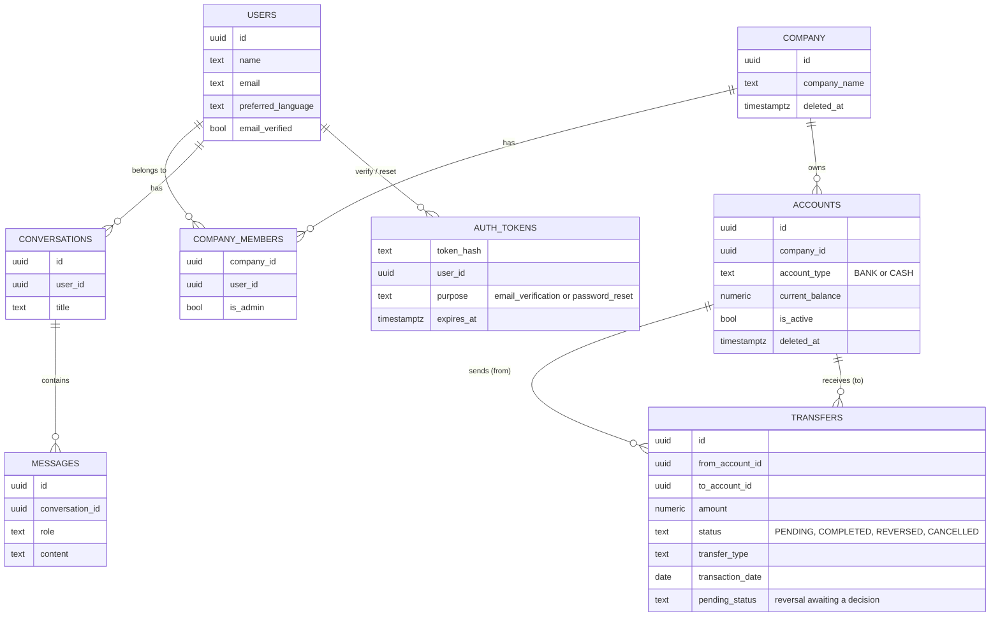
```mermaid
erDiagram
    USERS ||--o{ COMPANY_MEMBERS : "belongs to"
    COMPANY ||--o{ COMPANY_MEMBERS : has
    COMPANY ||--o{ ACCOUNTS : owns
    ACCOUNTS ||--o{ TRANSFERS : "sends (from)"
    ACCOUNTS ||--o{ TRANSFERS : "receives (to)"
    USERS ||--o{ CONVERSATIONS : has
    CONVERSATIONS ||--o{ MESSAGES : contains
    USERS ||--o{ AUTH_TOKENS : "verify / reset"

    USERS {
        uuid id
        text name
        text email
        text preferred_language
        bool email_verified
    }
    COMPANY {
        uuid id
        text company_name
        timestamptz deleted_at
    }
    COMPANY_MEMBERS {
        uuid company_id
        uuid user_id
        bool is_admin
    }
    ACCOUNTS {
        uuid id
        uuid company_id
        text account_type "BANK or CASH"
        numeric current_balance
        bool is_active
        timestamptz deleted_at
    }
    TRANSFERS {
        uuid id
        uuid from_account_id
        uuid to_account_id
        numeric amount
        text status "PENDING, COMPLETED, REVERSED, CANCELLED"
        text transfer_type
        date transaction_date
        text pending_status "reversal awaiting a decision"
    }
    CONVERSATIONS {
        uuid id
        uuid user_id
        text title
    }
    MESSAGES {
        uuid id
        uuid conversation_id
        text role
        text content
    }
    AUTH_TOKENS {
        text token_hash
        uuid user_id
        text purpose "email_verification or password_reset"
        timestamptz expires_at
    }
```

`backend/migrations/2026_10_soft_delete.sql` adds the `deleted_at` columns used by soft delete.

## API overview

All routes are under `/api/v1`. Everything except the public auth routes needs
`Authorization: Bearer <token>`. `GET /health` is available for uptime checks.

<details>
<summary><strong>Show all endpoints</strong></summary>

**Auth (public)**

| Method | Path | Purpose |
|---|---|---|
| POST | `/auth/signup` | Create an account |
| POST | `/auth/signin` | Sign in, returns a token |
| POST | `/auth/forgot-password` | Email a reset link (same response whether or not the email exists) |
| POST | `/auth/reset-password` | Set a new password with a reset token |
| POST | `/auth/verify-email` | Verify an email address |

**Auth (signed in)**

| Method | Path | Purpose |
|---|---|---|
| POST | `/auth/refresh` | Extend a still-valid session |
| POST | `/auth/resend-verification` | Re-send the verification email |

**Users**

| Method | Path | Purpose |
|---|---|---|
| GET / PUT / DELETE | `/users/:id` | Read, update, delete a user |
| GET | `/users` | List users |
| POST / DELETE | `/users/:id/profile-picture` | Upload or remove a profile picture |
| PATCH | `/users/:id/password` | Change password |

**Companies**

| Method | Path | Purpose |
|---|---|---|
| GET / POST | `/companies` | List your companies / create one |
| GET | `/companies/:id` | One company |
| PUT | `/companies/:id` | Rename (admin, needs password) |
| DELETE | `/companies/:id` | Soft-delete with all its accounts (admin, needs password) |
| GET | `/companies/:id/transfers/summary` | Computed transfer summary (no AI) |
| GET | `/companies/:id/insights` | The same summary, phrased by the AI |
| GET / POST | `/companies/:id/members` | List / add members |
| PATCH / DELETE | `/companies/:id/members/:user_id` | Change role / remove member |

**Accounts**

| Method | Path | Purpose |
|---|---|---|
| GET / POST | `/accounts` | List (`?company_id=`) / create |
| GET / PUT / DELETE | `/accounts/:id` | Read, update (activate/deactivate), soft-delete |

**Transfers**

| Method | Path | Purpose |
|---|---|---|
| GET / POST | `/transfers` | List (`?company_id=` `?account_id=` `?status=`) / create |
| GET | `/transfers/:id` | One transfer |
| PATCH | `/transfers/:id/approval` | Approve or reject whatever is awaiting a decision |
| PATCH / DELETE | `/transfers/:id/propose` | Propose a reversal / withdraw your own proposal |
| POST | `/transfers/search` | Natural-language search |

**Reports, insights and the assistant**

| Method | Path | Purpose |
|---|---|---|
| GET | `/reports` | Report numbers + AI summary (`?company_id=` `?since=` `?until=`) |
| GET | `/reports/explain` | AI explanation of one chart (`?chart=volume\|status\|companies\|flow\|type\|accounts`) |
| GET | `/insights/overview` | AI summary across all your companies |
| POST | `/chat` | One-off assistant question |
| GET / POST / DELETE | `/conversations`, `/conversations/messages`, `/conversations/:id` | Saved assistant conversations |

</details>

## Getting started

### Prerequisites

- **Go 1.22+**
- **Node.js 18+** and npm
- **PostgreSQL** (a local install or a hosted one such as Supabase)
- Optional: a [Gemini API key](https://aistudio.google.com/) for AI text and a [Resend](https://resend.com) key for emails

### 1. Clone

```bash
git clone <your-repo-url>
cd Lekha-api
```

### 2. Database

Create an empty PostgreSQL database and create the tables described under [Data model](#data-model)
(`users`, `company`, `company_members`, `accounts`, `transfers`, `auth_tokens`, `conversations`,
`messages`), using the status values and transfer types described above. Then apply the migration:

```bash
psql -h localhost -U postgres -d lekha -f backend/migrations/2026_10_soft_delete.sql
```

> **Note:** the repository does not yet include a complete `schema.sql`. The [Data model](#data-model)
> section lists the tables and key columns the backend queries; the migration only adds the
> `deleted_at` columns used by soft delete.

### 3. Backend

```bash
cd backend
cp .env.example .env      # then edit: database credentials, JWT_SECRET, ALLOWED_ORIGINS, FRONTEND_URL …
go run .                  # starts on http://localhost:8080
```

Check it is alive: `curl http://localhost:8080/health`.

### 4. Frontend

```bash
cd frontend
cp .env.example .env      # VITE_API_URL=http://localhost:8080/api/v1
npm install
npm run dev               # http://localhost:5173
```

Open the app, **sign up**, create a company, add a couple of accounts and make your first transfer.

### Production build

```bash
cd frontend && npm run build     # outputs frontend/dist
cd backend && go build -o lekha-api .
```

Serve `frontend/dist` from any static host with a single-page-app fallback (so deep links like `/app/reports`
load `index.html`), run the Go binary behind HTTPS, and set `ALLOWED_ORIGINS` and `FRONTEND_URL` to the
deployed frontend URL.

## Configuration reference

**Backend (`backend/.env`)**

| Variable | Required | Purpose |
|---|---|---|
| `DB_HOST` `DB_PORT` `DB_USER` `DB_PASSWORD` `DB_NAME` | yes | PostgreSQL connection |
| `DB_SSLMODE` | yes | `disable` locally, `require` for most hosted databases |
| `JWT_SECRET` | yes | Secret used to sign session tokens — use a long random value |
| `PORT` | no | Defaults to `8080` |
| `ALLOWED_ORIGINS` | yes for browsers | Comma-separated frontend origins allowed by CORS |
| `FRONTEND_URL` | for email links | Base URL used in verification / reset emails |
| `GEMINI_API_KEY` | for AI text | Insights, explanations, assistant, natural-language search |
| `RESEND_API_KEY`, `EMAIL_FROM` | for email | Verification and password-reset emails |
| `SUPABASE_URL`, `SUPABASE_SERVICE_ROLE_KEY`, `SUPABASE_STORAGE_BUCKET` | for avatars | Profile pictures |

**Frontend (`frontend/.env`)**

| Variable | Purpose |
|---|---|
| `VITE_API_URL` | API base URL including `/api/v1` |

> Never commit real `.env` files or API keys. Only the `*.env.example` templates belong in the repo.

## Project structure

```
Lekha-api/
├── backend/
│   ├── main.go              # server, CORS, /health
│   ├── routes/              # route table
│   ├── handlers/            # auth, users, companies, accounts, transfers, reports,
│   │                        # insights, search, assistant (chat + conversations)
│   ├── middleware/          # JWT authentication
│   ├── models/              # request / response shapes
│   ├── utils/               # jwt, rate limiting, membership checks, LLM client,
│   │                        # email, storage, i18n catalogues, insight cache
│   ├── migrations/          # SQL migrations
│   └── config/              # database connection
├── frontend/
│   ├── public/              # favicon and icons
│   └── src/
│       ├── components/      # pages and UI (landing/, ui/ for primitives)
│       ├── styles/          # design tokens live in index.css; per-area stylesheets here
│       ├── motion/          # shared animation variants (respects reduced motion)
│       ├── i18n.jsx         # English + Hindi dictionary
│       ├── api.js           # API client
│       └── App.jsx          # routes
└── docs/images/             # screenshots used in this README
```

## Development notes

- **Backend tests:** `cd backend && go test ./...` runs the unit tests for the pure logic helpers.
- **Frontend build check:** `cd frontend && npm run build`.
- **Translations:** every user-facing string goes through `src/i18n.jsx` with an English and a Hindi entry;
  server messages live in `backend/utils/i18n.go`.
- **Design tokens:** colours, spacing and type are CSS variables in `src/index.css`; light and dark share
  the same variables. New screens should use the tokens rather than hard-coded colours.
- **Screenshots in this README** were captured from the real UI running against fictional sample data.
